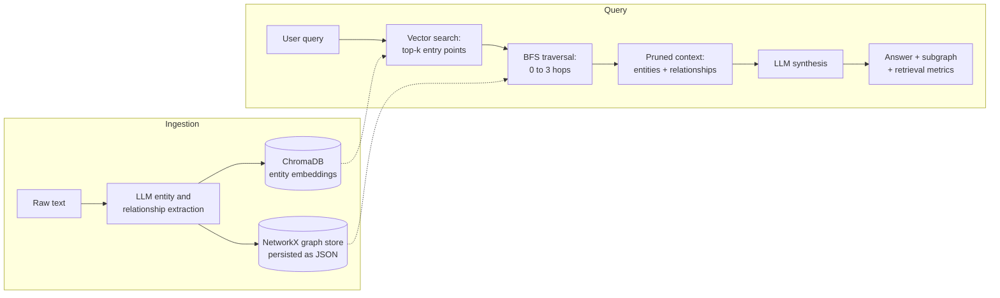

# GraphRAG Prototype

[](https://github.com/yash27-lab/graphrag-prototype/actions/workflows/ci.yml)
[](LICENSE)

A full-stack implementation of Graph Retrieval-Augmented Generation: instead of retrieving isolated text chunks by vector similarity, it extracts an entity knowledge graph from ingested text, finds semantically relevant entry points with vector search, then traverses the graph to assemble multi-hop context for the LLM.

The backend is a layered FastAPI service (NetworkX graph store, ChromaDB vector index, Gemini for extraction and synthesis) with a hermetic test suite that runs without an API key. The frontend is a React + TypeScript app with an interactive force-directed visualization of exactly the subgraph each answer was grounded in.

## The problem

Standard RAG retrieves the top-k chunks most similar to the query and hopes the answer is inside them. That works for single-fact lookups and fails predictably on multi-hop questions:

> "Who is the CEO of the parent company of WhatsApp?"

No single chunk mentions WhatsApp and the CEO together. Vector similarity finds the WhatsApp chunk, misses the acquisition and rebranding chunks, and the model either refuses or hallucinates the connection.

GraphRAG makes the relationships first-class. At ingestion time an LLM extracts entities and typed relationships into a knowledge graph. At query time, vector search only picks the entry points; breadth-first traversal walks the graph to pull in entities that are logically connected but semantically distant from the query. The LLM answers from that pruned, connected context.

## How it works



The interesting property: with traversal depth 0 the system degrades to standard RAG (entry points only). Every additional hop widens the context along explicit relationships rather than embedding similarity. The test suite encodes this directly: [test_multihop.py](backend/tests/test_multihop.py) builds a four-entity supply chain and asserts that depth 0 cannot see downstream entities, depth 2 reaches two hops out, and depth 3 reaches the end of the chain.

## Quick start

### Docker (recommended)

```bash
export GEMINI_API_KEY="your_api_key_here"   # or put it in backend/.env
docker compose up --build
```

Frontend at `http://localhost:5173`, backend at `http://localhost:8000` (interactive API docs at `/docs`). Graph and embeddings persist in a named volume across restarts.

macOS without Docker Desktop: `brew install colima docker docker-compose && colima start`.

### Manual

Backend:

```bash
cd backend
pip install -r requirements.txt
cp .env.example .env          # optional: put GEMINI_API_KEY here
uvicorn main:app --reload
```

Frontend (separate terminal):

```bash
cd frontend
npm install
npm run dev
```

The frontend reads `VITE_API_URL` if the backend is not on `http://localhost:8000`. An API key entered in the UI settings is sent per-request via the `x-api-key` header and takes precedence over the backend environment key.

## API

| Method | Path | Description |
| --- | --- | --- |
| POST | `/ingest` | Extract entities and relationships from text; upsert into graph and vector index |
| POST | `/query` | Answer a question: vector entry points, BFS traversal (`depth` 0-3, `top_k` 1-10), LLM synthesis |
| GET | `/graph` | Full persisted graph, for visualization |
| DELETE | `/graph` | Reset the knowledge base (graph, embeddings, and files on disk) |
| GET | `/health` | Liveness plus entity and relationship counts |

Query responses include retrieval metrics: which entities the vector search seeded, how many entities and relationships the traversal pulled in, and an estimate of context tokens sent to the LLM.

## Testing

```bash
cd backend
pip install -r requirements-dev.txt
python -m pytest
ruff check .
```

The suite (19 tests, under a second) is fully hermetic: a fake LLM returns canned extractions and a deterministic bag-of-words embedding function replaces the default ONNX model, so no API key, network access, or model download is needed. Coverage includes:

- The multi-hop thesis as executable assertions (depth 0 vs 2 vs 3 over a chained graph)
- Ingestion idempotency: re-ingesting an entity updates it in place instead of duplicating it
- Malformed LLM extraction output is sanitized, not crashed on
- State survives a simulated server restart (graph JSON and Chroma both reload)
- Upstream LLM failures map to accurate HTTP statuses (429 rate limit, 401 bad key) instead of a generic 500

CI runs lint and tests for the backend plus lint and build for the frontend on every push.

## Benchmarks

```bash
export GEMINI_API_KEY="your_api_key_here"
python3 benchmarks/run_benchmarks.py
```

The script resets the knowledge base, ingests three multi-hop scenarios ([benchmark_data/test_paragraphs.md](benchmark_data/test_paragraphs.md)), and runs each query twice: depth 0 (standard RAG baseline) and depth 2 (GraphRAG). Example output:

```text
SCENARIO: Supply Chain Impact
QUERY: How does a strike at the Lithium mine affect the production of the new EV model?

  [Standard RAG - depth 0] entities=2 relationships=0 context_tokens~38
  Answer: I don't have enough context to connect the mine to the EV model.

  [GraphRAG - depth 2] entities=5 relationships=4 context_tokens~104
  Answer: The strike at the Salar de Atacama Lithium Mine halts the supply of
  high-grade lithium carbonate to ElectroChem Industries, which cannot deliver
  solid-state battery packs to Apex Motors, delaying production of the Apex Nova EV.
```

LLM outputs vary between runs; the retrieval metrics (which entities were reachable at each depth) are the stable, comparable part.

## Design decisions and tradeoffs

**NetworkX over a graph database.** The graph lives in process memory and serializes to JSON (written atomically) after each mutation. For a prototype whose corpus is pasted documents, this removes an entire infrastructure dependency while keeping traversals trivial to express and test. The `GraphStore` interface is deliberately narrow (`upsert`, `expand`, `node_records`, `edge_records`) so a Neo4j- or Memgraph-backed implementation could replace it without touching the pipeline.

**One embedding per entity, not per chunk.** Vector search here only selects traversal entry points, so entities are embedded as `name: description`. Including the name means a query that mentions an entity directly matches even when its description does not repeat it. The source text is not chunk-indexed at all, which is the main deliberate simplification (see limitations).

**Traversal depth is capped and user-controlled.** Depth is validated server-side (0-3). In a densely connected graph, BFS context grows quickly with depth; the cap plus the per-query token estimate keeps the "pruned context" claim honest and measurable in the UI.

**Extraction is schema-constrained but defensively parsed.** Gemini is asked for strict JSON (using JSON response mode), and the pipeline still sanitizes the result: entities without ids, non-dict items, and whitespace-padded names are dropped or normalized rather than crashing ingestion.

**The LLM layer is a seam.** `GeminiService` is the only file that talks to the model API, and the app factory accepts any object with the same two methods. That is what makes the test suite hermetic, and it is also the migration path to another provider.

## Limitations and roadmap

- **Entity resolution is exact-match.** "Facebook Inc." and "Meta Platforms Inc." are distinct nodes unless the extraction links them. Alias detection (embedding similarity over node names, or an LLM resolution pass) is the highest-value next step.
- **No source-text grounding.** Answers are synthesized from extracted descriptions, not original passages. Storing chunk references on nodes and edges would enable citations back to the source text.
- **Single-process state.** The in-memory graph means one worker. Scaling out requires moving `GraphStore` behind a real graph database, which the interface already anticipates.
- **No answer-quality evaluation.** The benchmark compares retrieval reachability; an LLM-as-judge scoring harness over a labeled question set would quantify answer quality properly.
- **Retrieval is unweighted BFS.** Edge relevance scoring (or personalized PageRank from the entry points) would rank which neighbors deserve the token budget at higher depths.

## Project structure

```
backend/
  main.py                  Entrypoint (uvicorn main:app)
  graphrag/
    api.py                 FastAPI app factory, routes, error mapping
    pipeline.py            Ingestion and retrieval orchestration
    graph_store.py         NetworkX graph with atomic JSON persistence
    vector_store.py        ChromaDB entity index, injectable embeddings
    llm.py                 Gemini wrapper, prompts, error translation
    schemas.py             Pydantic request/response models
    config.py              Environment-driven settings
  tests/                   Hermetic pytest suite (no API key needed)
frontend/
  src/App.tsx              UI: ingest, query, settings, metrics
  src/components/          Force-directed graph visualization
benchmarks/                Standard RAG vs GraphRAG comparison script
benchmark_data/            Multi-hop test scenarios
.github/workflows/ci.yml   Backend lint+tests, frontend lint+build
```

## Troubleshooting

- **429 RESOURCE_EXHAUSTED during ingestion:** `gemini-2.5-pro` has strict free-tier limits. Switch to `gemini-2.5-flash` in the UI settings or enable billing on your Google Cloud project. The API now surfaces this as an actual 429 with a readable message.
- **Empty canvas after restart:** should not happen; the frontend loads the persisted graph on startup. If the backend moved, set `VITE_API_URL`.

## License

MIT. See [LICENSE](LICENSE).
